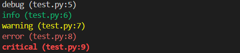
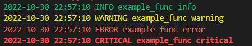

[](https://badge.fury.io/py/miskibin)

# miskibin

this repo contains some of my scripts and tools, that i
could not find anywhere else.

## installation:

```bash
pip install miskibin
```

## description

module contains some useful functions, that i use in my projects.

## usage

### get_logger

returns highly configurable logger object.

- Every level has its own color. (If it is printed to terminal)
- Problems with logging messages from `ipynb` cells are resolved.
- Includes validation for file name and path.
- Has `disable_existing_loggers` param to disable all other loggers.
#### params:
   - `file_name`: file that logs will be saved to. If None, logs will not saved to file.
   - `lvl`: logging level. Default is 20 (info). to see debug logs, set it to `10` or `'DEBUG'`.
   - `formatter`: logging formatter.
   - `datefmt`: date format for logging formatter.
   - `disable_existing_loggers`: if True, disable existing loggers.
#### Example 1:

```python
from miskibin.utils import get_logger
logger = get_logger()
logger.debug("debug")
logger.info("info")
logger.warning("warning")
logger.error("error")
logger.critical("critical")
```

#### output:



#### example 2:

```python
from miskibin.utils import get_logger
logger = get_logger(
    datefmt="%Y-%m-%d %H:%M:%S",
    format="%(asctime)s %(levelname)s %(funcName)s %(message)s",
    disable_existing_loggers=True,
    logger_name="test2",
    lvl="INFO",
)


def example_func():
    logger.debug("debug")
    logger.info("info")
    logger.warning("warning")
    logger.error("error")
    logger.critical("critical")
example_func()
```

#### output:


